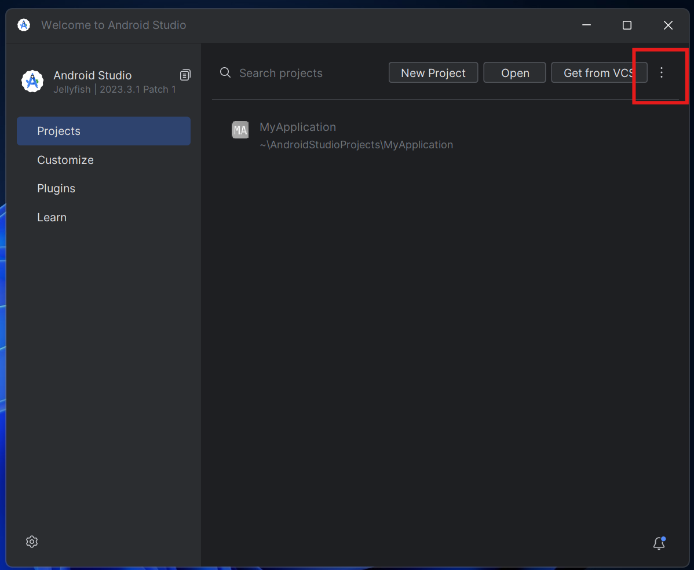
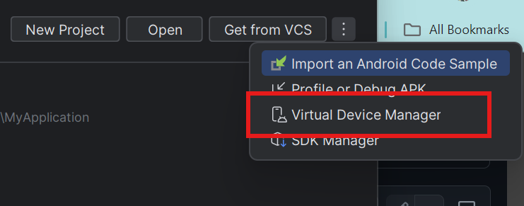
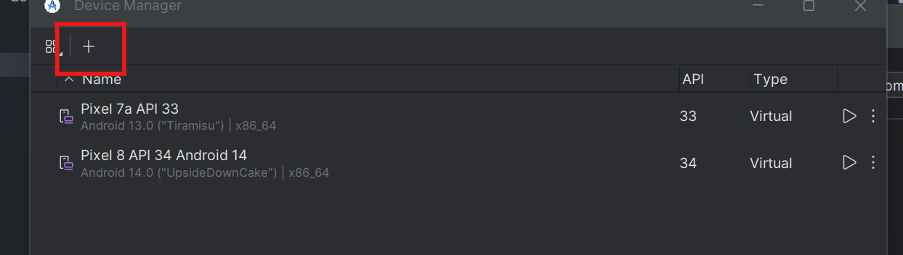
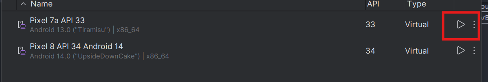
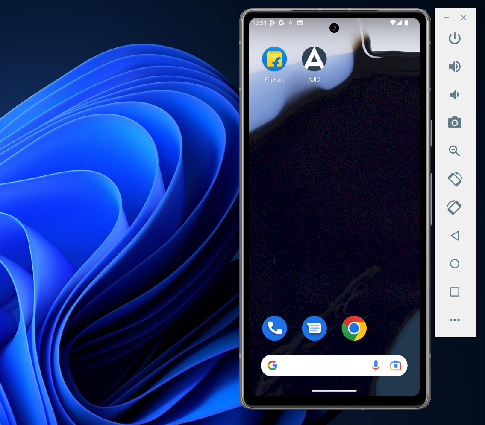

Install Python version 3 - https://www.python.org/downloads/

Install Appium Inspector - https://github.com/appium/appium-inspector/releases

Install Appium Server GUI - https://github.com/appium/appium-desktop/releases

Install Node JS - for the command line - https://nodejs.org/en/download/prebuilt-installer
    Open the command prompt and type appium - To run the Appium Server

Install Android Studio - for Emulator - https://developer.android.com/studio?gad_source=1&gclid=CjwKCAjw_ZC2BhAQEiwAXSgClmDV3jOoFD09kLsqAYq2ZQT1ap1OWOVRgtywxaDkB5PmKiYsczbBvBoC7qIQAvD_BwE&gclsrc=aw.ds
    1. Once installation is done open Android Studio
    2. Click to 3 dots
    
    3. Now click to Virtual Device Manager
    
    4. Now click to + icon for creating emulator (if not created previoslly)
    
    5. Click to play button once emulator device is added
    
    6. Now we are able to see emulator
    
    7. Now install the app from play store
Once Emulator is started and appium server is running then run the runner.bat file to install respective dependencies and start the execution

Install  Python Libraries - pip3 install -r requirements.txt
Pytest command to run the test - pytest .\TestCases\test_flipkart_product_search.py --alluredir="./allureReports/
To generate the allure report - allure serve allureReports